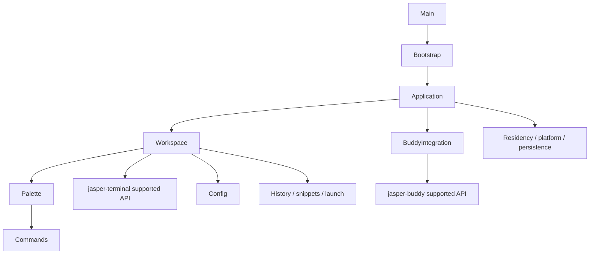

# Application and Buddy architecture

The app is the composition root for two independent libraries. The refactor preserves
user-visible terminal behavior and establishes clear owners for future features. It
introduces no plugin loader, stable plugin ABI or third-party permission model.



This diagram names major collaborations; package-info files and the bytecode checks
record the full package DAG. Neither library imports the app or the other library.
App terminal use is restricted to the documented allowlist; no `internalAccess()` or
vendor emulator types cross the boundary. App Buddy use is restricted to its five
supported top-level types and nested values. Both package graphs must remain acyclic.

## Patterns chosen for actual work

The command registry joins real Swing actions, metadata, shortcuts and palette dispatch.
Immutable configuration builders preserve all untouched fields. Concrete coordinators
own startup, session admission and shutdown. Buddy has one facade over its bounded model
and lazy windows. Typed workspace events and JDK callbacks report upward without facade
back-references. PaletteScope has three real providers; no speculative interface or
emulator-backend abstraction was introduced.

App Java-public classes enable feature collaboration; they are not a supported external
SDK. Later plugins may adapt these boundaries after lifecycle, versioning, permissions
and loading policy are designed. Do not infer SDK guarantees from Java visibility.

## Startup, lifetime and shutdown

```mermaid
sequenceDiagram
  participant Bootstrap as ApplicationBootstrap
  participant Resources as StartupResources
  participant App as JasperApplication
  participant Launches as SessionLaunchCoordinator
  participant Workspace
  participant Buddy as BuddyIntegration
  Bootstrap->>Bootstrap: Parse arguments / attempt resident handoff before AWT
  Bootstrap->>Resources: Own acquired configuration, logging, hooks
  Bootstrap->>App: Compose on EDT; transfer owners after wiring
  App->>Buddy: Configure one companion model; native show remains lazy
  App->>Workspace: Create window with immutable launch snapshot and callbacks
  Workspace->>Launches: ShellLauncher submits captured request
  Launches-->>Workspace: ShellLauncher delivers on EDT; pane rejects closed origin
  Bootstrap->>Resources: Transfer successful startup ownership
  Workspace-->>App: Pane/window activity and closure
  App->>Workspace: Quit closes panes and subscriptions
  App->>Launches: Stop admission; late returned sessions close
  App->>Buddy: Close notifier first, then companion and global listener
  App->>App: Close history/config/providers/native handlers/endpoint
  App->>App: ApplicationShutdown waits off EDT with bounded timeout
```

`StartupResources` rolls back reverse acquisition order once and suppresses cleanup
failures onto the original error. Pre-EDT and EDT composition use separate scopes.
A successful resident handoff creates no window. Endpoint bind failure cannot silently
leave a background process. Logging cleanup and final process waiting do not block Swing.

A pane owns its admitted session. The launch coordinator stops admission and closes
late arrivals; it does not force-close a session before its pane has completed cleanup.
Shutdown waits for accepted launch workers, their late child exits, tracked process exits,
command-history flush and endpoint cleanup with the existing two-second bound. Endpoint
lock/probe cleanup runs on daemon workers; both ordinary quit and startup rollback
queue this cleanup without blocking EDT. The two-second bound covers the application
wait, not a promise that every cleanup succeeds or the JVM exits within two seconds.
The process shutdown hook backs up endpoint cleanup and drains logging separately.
Residency retains indexes/config/history after the last window,
and does not intentionally retain pane sessions; asynchronous child cleanup may
briefly continue after the last window closes. Quit closes all owners.

## Threading and cancellation

Swing workspace, palette, theme subscriptions, notice producers and Buddy run on EDT.
Shell creation, bounded file reading and process waiting run on their existing workers.
The terminal library retains its own reader-thread/buffer-lock contract. Do not call
Swing synchronously while holding a terminal buffer lock.

Palette completion captures a generation, step, scope and origin. A queued callback
rechecks them after reaching EDT; dismissal, scope replacement or origin closure
invalidates it. WindowCommandPalette separately captures the pane/tab and requires
them to remain current in an active, open workspace. Completion guards prevent stale
UI publication; they do not undo provider work already submitted, such as a snippet
append. Subscriptions close once and detach from the actual owner.

Workspace OPENED precedes command events; app notification wiring registers opaque pane
IDs. CLOSED removes the active ID before timer cancellation/orphaning. A saved delayed
callback or late finished event cannot resurrect that pane. There is no growing tombstone
set. App closes notifier before Buddy. Hiding Buddy retains its model and stops animation;
closing clears model closures and all presentation resources.

## Saved versus temporary configuration

`ConfigSnapshot` validates immutable canonical values; builder and toBuilder use that same
validation. `WorkspaceConfiguration` compares each live saved field with its previous
saved value: unchanged defaults preserve temporary font, toolbar, status-bar and tab-height
choices. `ConfigurationController` sends appearance to `ThemeController`, whose ThemeState
separately preserves a temporary theme choice until the saved appearance changes.

Existing terminal views copy current options before replacing configured fields, preserving
unrelated options and temporary font size when the saved size is unchanged. Live fields
include font, cursor, Option-as-Meta, copy-on-select and bell behavior; pane dimming and
shell-exit policy are updated separately. Scrollback capacity, shell command/arguments,
environment and integration mode are captured by `LaunchSettings` for each launch request.
The initial grid is captured once per window by `JasperApplication.windowLauncher`; a later
saved grid change applies to new windows. Scrollback capacity belongs to the session and
is not resized by applying view options. A pending pane receives the latest live view
configuration in `WindowContent.configurePane` when its session arrives.

ThemeController publishes resolved values; platform title bars receive components and
callbacks. Application-level Buddy enablement, snippet reload and login-item reconciliation
are wired by JasperApplication. Residency is decided at startup, not changed by a reload.

## Package ownership

| Package | Owner and thread/lifetime contract |
| --- | --- |
| `root` | Stable launcher only; delegates to bootstrap. No owned resources. |
| `bootstrap` | Pre-AWT argument/handoff flow and EDT composition. StartupResources owns rollback until explicit transfer. |
| `application` | EDT application composition and feature lifetimes; launch coordinator synchronizes admission and shutdown waits off EDT. JasperApplication closes children. |
| `workspace` | EDT windows, tabs, splits, panes, action/config adapters and activity events. WindowContent closes subscriptions/panes; each pane closes its session. |
| `commands` | EDT action registry and pure command ranking/metadata. Registry owns listeners until registration or registry close. |
| `palette` | EDT scope/query/step state, keyboard routing and Swing card. Controller owns scope listeners and invalidates asynchronous completions on close. |
| `palette.builtin` | EDT adapters for commands, shell history and snippets. Providers own I/O; scope subscriptions are disposed by the palette. |
| `config` | Immutable values and pure parsing; ConfigService owns background watch/reload work and marshals delivery to EDT. Application closes the service. |
| `appearance` | EDT theme resolution and global look-and-feel installation. Subscribers own returned cancellation handles. |
| `launch` | Immutable launch capture and shell integration extraction; ShellLauncher starts off EDT and delivers on EDT. Receiving pane owns the session. |
| `history` | Pure parsing/snapshots plus EDT indexes backed by workers. Application owns indexes and command-history flush at shutdown. |
| `snippets` | Immutable snippet values, bounded persistence and EDT store over workers. Application closes the store; caller closes subscriptions. |
| `notifications` | EDT terminal notice production, active producer identities, attention and visibility policy. Application closes notifier before companion. |
| `residency` | Bounded interprocess protocol and endpoint workers. Bootstrap transfers endpoint close to application shutdown and process-hook backup. |
| `platform` | OS adapters, icons, fonts, title-bar paint and logging. Callers own registrations and native handles; Swing operations run on EDT and logging has its own worker. |
| `persistence` | Bounded TOML reads and atomic writes; synchronous helpers own short-lived file handles. Caller chooses thread and lifecycle. |
| `lifecycle` | Owner-thread-confined once-only cancellation. The subscriber closes the handle; no background worker or global state. |
| `benchmark` | Explicit opt-in native benchmark orchestration and reports. Benchmarks own and close fixtures; never part of headless check. |

Buddy's supported packages are `view`, `notice` and `config`; its internal model and
animation packages do not depend on presentation. Presentation depends on those pure
owners and values. The facade alone coordinates both. The full outgoing dependency
list is documented in each package-info file and verified from compiled bytecode.

## Resources and verification

FlatLaf defaults and shell scripts keep their existing classpath paths. Reflection-based
class references in theme properties must track package moves. Icons use absolute paths;
Buddy loads its sprite relative to BuddySprite in its own jar. Artifact tests open actual
jars, decode the PNG, resolve the configured divider class and reject test fixtures.

Run `./gradlew verifyTerminalArchitecture verifyApplicationArchitecture check :jasper-app:installDist`.
The terminal checker enforces its existing allowlist; the app/Buddy checker validates
all package edges and supported Buddy signatures. Neither uses cycle exemptions.
Javadoc and copied guide examples are normal check dependencies. See the
[verification report](app-refactor-verification.md) for current evidence and manual gaps.
