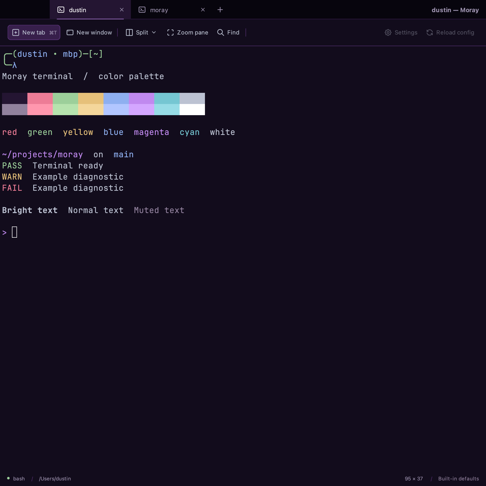

# Moray Dark Purple

`moray-dark-purple` is the default app and terminal palette, paired with the
existing `moray-light` palette under Follow System. The Eclipse app icon supplies
the near-black purple surfaces, violet accents, white cursor and cool-gray text.



## Main colors

| Role | Color |
|---|---|
| Terminal, toolbar, menus and status background | `#120C1C` |
| Title background | `#07050D` |
| Active tab background | `#241532` |
| Main text / toolbar icons | `#BCC2D2` |
| Active tab text / terminal cursor | `#FFFFFF` |
| Accent / tab underline | `#C089EF` |
| Selection | `#492B61` |
| Hover | `#301A42` |
| Primary button | `#371F4B` |
| Primary button border | `#5C347C` |
| Border / separator | `#4E2C69` |
| Muted chrome text | `#9C91AE` |

The sixteen ANSI entries retain conventional color meanings. All fifteen entries
other than normal black have at least 4.5:1 contrast against the terminal
background; normal text has approximately 10.76:1. Normal black is intentionally
a dark background color. ANSI colors 16–255 and application-supplied truecolor
values retain their existing behavior.

[Complete terminal palette](../../examples/themes/moray-dark-purple.toml)

## Defaults and compatibility

```toml
[colors]
appearance = "system"
theme = "moray-dark-purple"
```

Use `appearance = "dark"` to keep purple active regardless of the OS. Explicitly
selecting only `theme = "moray-dark-purple"` also selects dark appearance, matching
the existing built-in-selector behavior.

`moray-dark` remains available with its original terminal and chrome colors;
`moray-light` is unchanged. Existing explicit theme selections are not rewritten.
Custom files keep their documented fixed classic `moray-dark` inheritance for
omitted colors. Their terminal palette stays fixed while their chrome follows
appearance; default dark chrome is now purple.

## Implementation and verification

- Terminal definition: `Palette.morayDarkPurple()`; standalone terminal defaults
  and app config defaults use the new palette.
- Chrome definition: `MorayDarkPurpleLaf.properties`, layered over FlatDarkLaf.
  The separate LAF variant preserves classic dark resources and switching.
- Regression checks exercise config/service loading, built-in lookup without a
  theme file, purple/light/classic/custom behavior, app component backgrounds,
  ANSI contrast, actual terminal cell rendering, and theme switching.
- `./gradlew check` passed on 2026-09-12: 585 tests, 584 passed, one existing font
  skip; both modules executed. Independent review found no actionable issues.
- Actual Swing renders were inspected in purple, classic and light modes; no
  JFrame or login shell was launched. These use a controlled `/bin/sh` fixture.
- Native Mac package verification passed after the theme integration. No native
  desktop or Windows acceptance is claimed.

Reproduce the renders:

```bash
./gradlew :moray-app:mockUiPreview --args="/absolute/output/path --palette"
```

The additional renders are [classic dark](mock-ui-classic_dark.png) and
[light](mock-ui-light.png).
