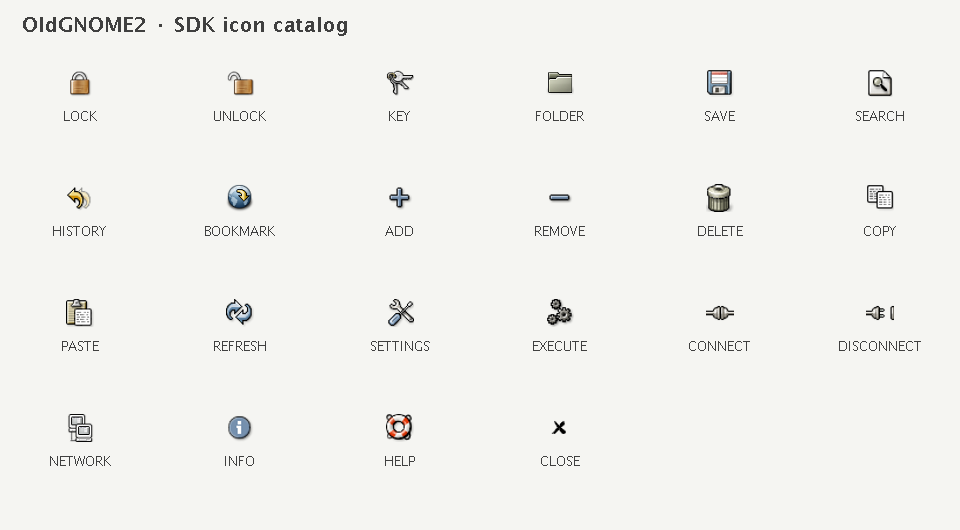

# Plugin icons for both skins

Requires SDK 0.7.2 (`sdk = ">=0.7.2, <0.8"` in plugin.toml).

```java
import dev.jasper.sdk.ui.OldGnomeIcon;

var icon = context.appearance().icon("dev/example/lock.svg", OldGnomeIcon.LOCK);
button.setIcon(icon);
```

Use the same icon for actions, toolbar dropdowns, rail/panels, status items, palette rows,
and ordinary Swing components. The SVG comes from your plugin's jars, must exist in both
skins, and should be monochrome. Modern mode recolors it to the live light/dark foreground.
Retro mode uses the selected bundled OldGNOME2 image with its original colors. A style
change takes effect after restarting Jasper, not on configuration reload.

Returned icons are 16 logical pixels. Retro host toolbars obtain a separate 28px variant;
sharing the original among a menu, palette and several windows never resizes it. Ordinary
plugin buttons stay 16px. Existing one-argument icon calls and custom Swing Icon implementations
retain their behavior. Existing implementations of Appearance inherit modern-only fallback;
they can override the overload to support retro. Old plugins run on the new host; plugins
calling the new overload must declare the new minimum SDK.

## OldGNOME2 catalog

These are original OldGNOME2 choices, independent of the built-in toolbar's Tango artwork.
The app bundles originals, GPL2+ license, provenance notice and hashes; plugins do not ship
copies or depend on a local Downloads folder. Missing large originals are scaled from the
largest available size, so some choices appear softer in enlarged/HiDPI toolbars.



Original paths are relative to a source size directory in the supplied collection:

| Constant | Original resource |
| --- | --- |
| `LOCK` | `stock/data/stock_lock.png` |
| `UNLOCK` | `stock/data/stock_lock-open.png` |
| `KEY` | `stock/generic/stock_keyring.png` |
| `FOLDER` | `filesystems/gnome-fs-directory.png` |
| `SAVE` | `stock/io/stock_save.png` |
| `SEARCH` | `actions/system-search.png` |
| `HISTORY` | `stock/navigation/stock_undo-history.png` |
| `BOOKMARK` | `places/user-bookmarks.png` |
| `ADD` | `actions/gtk-add.png` |
| `REMOVE` | `actions/gtk-remove.png` |
| `DELETE` | `actions/gtk-delete.png` |
| `COPY` | `stock/generic/stock_copy.png` |
| `PASTE` | `stock/generic/stock_paste.png` |
| `REFRESH` | `actions/view-refresh.png` |
| `SETTINGS` | `actions/gtk-preferences.png` |
| `EXECUTE` | `actions/gtk-execute.png` |
| `CONNECT` | `actions/gtk-connect.png` |
| `DISCONNECT` | `actions/gtk-disconnect.png` |
| `NETWORK` | `filesystems/gnome-fs-network.png` |
| `INFO` | `actions/gtk-info.png` |
| `HELP` | `actions/gtk-help.png` |
| `CLOSE` | `stock/generic/stock_close.png` |

## Test selection without a GUI

```java
try (var host = new FakePluginHost()) {
    host.setRetroIcons(true); // before starting any plugin
    var context = host.start(info, Set.of(), Set.of(), plugin);
    var icon = (FakeSkinIcon) context.appearance().icon(
        "dev/example/lock.svg", OldGnomeIcon.LOCK);
    assertThat(icon.retro()).isTrue();
    assertThat(icon.retroIcon()).isEqualTo(OldGnomeIcon.LOCK);
}
```

FakeSkinIcon records the requested SVG, enum and selected family, reports 16px dimensions,
and paints nothing. The fake defaults to modern; retro forces LIGHT and rejects DARK.
Set style before the first start, even if that start fails; use a new host to test another style.
Both real/fake hosts reject null enum choices and null/missing SVG resources in either skin.
