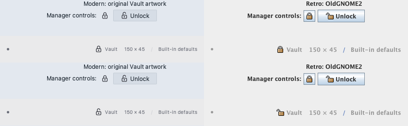

# Plugin icons for both skins

Prefer semantic names in SDK 0.7.4 (`sdk = ">=0.7.4, <0.8"` in plugin.toml):

```java
import dev.jasper.sdk.ui.IconName;

var lock = context.appearance().icon(IconName.LOCK);
var unlock = context.appearance().icon(IconName.UNLOCK);
button.setIcon(lock);
```

Jasper owns both images and chooses the running skin. Plugins supply no paths and perform
no style detection. Modern icons follow the live light/dark foreground; retro icons retain
OldGNOME2 colors. Vault uses these calls for its status/menu icon and manager lock/unlock
controls. Remote uses `IconName.NETWORK` for its Sessions toolbar, actions, host panel and status icon. Its modern lock/unlock resources are identical copies of its original SVG artwork.

Use the same icon for actions, toolbar dropdowns, menus, rail/panels, status items, palette
rows and ordinary Swing components. Returned icons are 16 logical pixels. Retro host
toolbars obtain a separate 28px variant, without changing shared compact icons. Style
changes take effect after restarting Jasper. Application resources load through the host's
class loader; a plugin does not need any image assets to use semantic icons.

`IconName` contains all 22 meanings shown below. Jasper maps each to its own modern SVG
and retro artwork. Existing `Appearance` implementations inherit a default method that
throws UnsupportedOperationException until they implement this new catalog; Jasper and
the testkit implement every name. Null names throw NullPointerException.

Headless render of actual manager buttons and status-bar controls, using named icons:



## Custom artwork remains supported

For a plugin-specific image, the original `icon("path/in/your/jar.svg")` remains available.
In SDK 0.7.4+, the custom overload also lets you choose a retro fallback explicitly:

```java
var custom = context.appearance().icon("dev/example/special.svg", OldGnomeIcon.EXECUTE);
```

Both arguments are required. The plugin's monochrome SVG must exist even in retro mode.
This is optional custom artwork; ordinary controls should prefer `icon(IconName)`.
Custom Swing icons and legacy single-path calls retain their behavior and dimensions.

## Named catalog: retro artwork

These are the retro mappings for IconName; OldGnomeIcon exposes the same choices for custom fallbacks.
These are original OldGNOME2 choices, independent of the built-in toolbar's Tango artwork.
The app bundles originals, GPL2+ license, provenance notice and hashes; plugins do not ship
copies or depend on a local Downloads folder. Missing large originals are scaled from the
largest available size, so some choices appear softer in enlarged/HiDPI toolbars.


Original paths are relative to a source size directory in the supplied collection:

| Constant | Original resource |
| --- | --- |
| `LOCK` | `stock/data/stock_lock.png` |
| `UNLOCK` | `stock/data/stock_lock-open.png` |
| `KEY` | `stock/generic/stock_keyring.png` |
| `FOLDER` | `filesystems/gnome-fs-directory.png` |
| `SAVE` | `stock/io/stock_save.png` |
| `SEARCH` | `actions/system-search.png` |
| `HISTORY` | `stock/navigation/stock_undo-history.png` |
| `BOOKMARK` | `places/user-bookmarks.png` |
| `ADD` | `actions/gtk-add.png` |
| `REMOVE` | `actions/gtk-remove.png` |
| `DELETE` | `actions/gtk-delete.png` |
| `COPY` | `stock/generic/stock_copy.png` |
| `PASTE` | `stock/generic/stock_paste.png` |
| `REFRESH` | `actions/view-refresh.png` |
| `SETTINGS` | `actions/gtk-preferences.png` |
| `EXECUTE` | `actions/gtk-execute.png` |
| `CONNECT` | `actions/gtk-connect.png` |
| `DISCONNECT` | `actions/gtk-disconnect.png` |
| `NETWORK` | `filesystems/gnome-fs-network.png` |
| `INFO` | `actions/gtk-info.png` |
| `HELP` | `actions/gtk-help.png` |
| `CLOSE` | `stock/generic/stock_close.png` |

## Test selection without a GUI

```java
try (var host = new FakePluginHost()) {
    host.setRetroIcons(true); // before starting any plugin
    var context = host.start(info, Set.of(), Set.of(), plugin);
    var icon = (FakeNamedIcon) context.appearance().icon(IconName.LOCK);
    assertThat(icon.name()).isEqualTo(IconName.LOCK);
    assertThat(icon.retro()).isTrue();
}
```

FakeNamedIcon records the semantic name and selected family, reports 16px dimensions and
paints nothing. The custom overload still returns FakeSkinIcon with its SVG path and retro
choice. The fake defaults to modern; retro forces LIGHT and rejects DARK. Set style before
the first start, even if it fails; use a new host to test another style.
