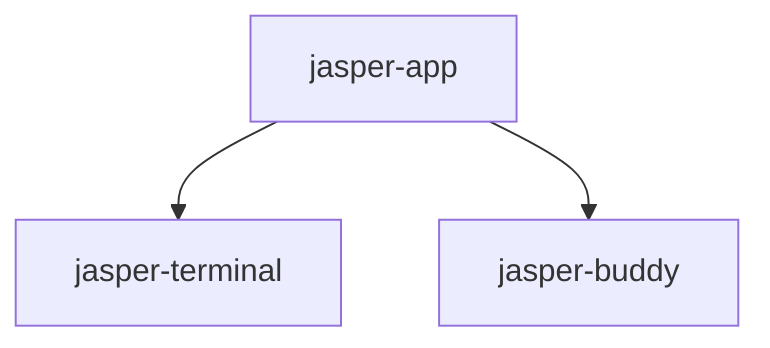

# Jasper application and Buddy architecture

**Date:** 2026-09-20  
**Status:** Approved, implemented and merged into local `main` through `9b30dc2` on 2026-09-21. Independent review and fresh-reader acceptance are complete; two shutdown findings were fixed and all headless checks pass. Native acceptance remains user-run. See the [verification report](../../app-refactor-verification.md).
**Baseline:** `c7b796b` on `main`, after the terminal refactor merge.  
**Scope:** Reorganize `jasper-app`, extract `jasper-buddy`, migrate repository callers/resources/build wiring, and provide executable developer documentation.

## 1. Intent and authority

The user wants the same maintainability achieved in the terminal refactor: a
modular Java project whose responsibilities, dependencies, extension routes,
threading and lifecycle can be understood without reconstructing AI conversation
history. Buddy should have its own Gradle module. Preserve existing behavior and
prepare clear boundaries for a future plugin SDK without implementing that SDK.

The accepted direction is three modules: `jasper-app` assembles the product,
`jasper-terminal` supplies the existing terminal library, and `jasper-buddy`
supplies the companion's notice model and presentation. Most app responsibilities
remain Java packages rather than becoming additional Gradle modules.

This design extends the [terminal architecture principles](2026-09-20-jasper-terminal-refactor-design.md)
and amends the original two-module constraint for this extraction. Existing
behavioral specifications, later feature amendments and repository safety rules
remain authoritative. This is not permission to redesign the UI, change shortcut
semantics, notification rules, configuration defaults or supported platforms.

Keep Java/JBR 25, Swing, Gradle wrapper and pinned dependencies. No new DI
framework, event bus, plugin loader, JPMS conversion, emulator abstraction or
external service. No new production interface without two real implementations;
existing meaningful interfaces and JDK functional callbacks remain appropriate.

## 2. Assessment

At the baseline, the app has 114 production Java files and 13,259 lines, all in
`dev.jasper.app`. The 23 Buddy-related candidates total 2,494 lines. Existing
code already has useful immutable records, controllers, pure policies, bounded
workers, command/scope registries and substantial tests. Preserve these strengths.

The principal issues are ownership and dependency direction, not a complete
absence of structure:

| Current location | Issue to address |
| --- | --- |
| Main, 269 lines | Nested startup composition, roles, logging, endpoint ownership and rollback |
| JasperApplication, 384 lines | Window roster, launches, shutdown, residency, Buddy integration and notification wiring |
| WindowContent, 664 lines | Window assembly, action dispatch, shortcuts, palette integration, settings and event propagation |
| CommandPalette, 641 lines | Presentation, query/selection navigation and optional step form ownership |
| WindowCommandPalette, 383 lines | Scope lifecycle mixed with concrete pane/tab/window focus and overlay attachment |
| ConfigSnapshot | References a window's nested toolbar enum, palette implementation bounds and history-provider defaults |
| ConfigurationController / ThemeController | Services hold concrete WindowContent rosters, reversing the intended dependency direction |
| PaletteTarget / PaletteContext | Capability values refer back to TerminalPane construction and a particular history provider |
| Buddy helpers | Mostly cohesive; app font resolution and TOML position persistence cross the proposed boundary |

The 23 candidates are not all library code. `BuddyVisibility` combines saved
configuration, session override and terminal-window state: it stays in the app.
`BuddyStateFile` owns an application file format and also stays in the app.

## 3. Modules and supported boundaries



Neither library depends on the app or the other library. Do not introduce a
`jasper-common` module for font lookup, state-file helpers or callback types.

`jasper-terminal` keeps its supported API and architecture checks. App code must
continue to avoid its internals and `internalAccess()`. Terminal changes are not
required for this refactor; any discovered need must be justified separately.

The app is an executable, not a new public library. Keep `dev.jasper.app.Main`
as a small stable launcher so packaged entry points do not change unnecessarily.
Its other packages are application implementation contracts even where Java
requires public visibility. Expose only needed cross-package collaborators;
do not make every former package-private method public to silence compiler errors.

Buddy has a small supported surface, with the same distinction between Java
visibility and supported API used by the terminal. All `internal` Buddy types
are excluded from app dependencies and public supported signatures. Public Buddy
APIs expose only supported Buddy and JDK types, never terminal/app/vendor types.

## 4. Application package map

Names below are destinations, not an instruction to copy current monoliths intact.
New concrete collaborators are specified in section 5. Test packages follow the
owners they exercise; cross-owner fixtures remain in test sources only.

| Package under dev.jasper.app | Existing classes / responsibility |
| --- | --- |
| root | Main: stable launcher delegating to bootstrap |
| bootstrap | AppArguments; startup/role/failure-cleanup portions extracted from Main |
| application | JasperApplication, ConfigurationController; application composition and window-to-feature wiring |
| workspace | TerminalWindow, WindowContent, WindowTabs, TerminalDeck, TerminalTab, TabState, TabMotion, SplitTree, SplitDividerBorder, TerminalPane, TerminalTitle, FindBar, InitialWindowSize, WindowChrome, WindowStatusBar; workspace-specific WindowCommands and WindowCommandPalette adapters |
| commands | ActionId, Command, CommandRegistry, CommandSearch; generic command identity, metadata, ranking and dispatch contracts |
| palette | CommandPalette, PaletteContext, PaletteTarget, PaletteResults, PaletteRow, PaletteStep, PaletteVerb, PaletteScope, ScopeRegistry, PaletteKeyRouter; presentation and scope lifecycle |
| palette.builtin | CommandsScope, ShellHistoryScope, SnippetsScope; adapters over actual data owners |
| config | ConfigSnapshot, ConfigDiagnostic, ConfigLoader, ConfigService, ConfigTemplate, FontConfig, TerminalConfig, KeyBindings, Appearance, ShellExitBehavior, ShellIntegrationMode; independent ToolbarMode and palette/history setting values |
| appearance | BuiltinTheme, ResolvedTheme, ThemeState, ThemeController; resolution and global look-and-feel installation |
| launch | DefaultShell, LaunchSettings, ShellLauncher, ShellIntegrationScripts |
| history | CommandHistory, CommandHistoryFile, HistoryShell, ShellHistoryEntry, ShellHistoryIndex, ShellHistoryParser, ShellHistorySnapshot, ShellHistorySource |
| snippets | Snippet, SnippetFile, SnippetStore |
| notifications | CommandNotice, CommandNotifier, BuddyVisibility; command attention policy and app-to-Buddy notice adaptation |
| residency | HandoffSocket, LaunchRequest; interprocess protocol and background endpoint ownership |
| platform | AppDirs, AppLog, AppIcons, ApplicationIcon, SystemFonts, MacTitleBar, NativeNotifier, ConfigEditor, LoginItem |
| persistence | TomlStateFile, BuddyStateFile; bounded file access and atomic writes |
| lifecycle | Subscription: extracted concrete cancellation handle currently nested in CommandRegistry |
| benchmark | Bench, MemoryBench, BenchmarkFixture, BenchmarkLifetime, BenchmarkMetrics, BenchmarkOptions, BenchmarkRendering, BenchmarkReport, BenchmarkRun |

The small `lifecycle` package serves existing command, scope and appearance
subscriptions; it is not a general lifecycle framework or service container.
`palette.builtin` is deliberately separate: the palette core must not depend on
history/snippet implementations, and those data owners must not depend on palette UI.

The workspace package intentionally keeps closely collaborating Swing window,
tab and pane code together initially. Splitting every widget into a subpackage
would manufacture APIs without improving ownership. Package-private controllers
within workspace are preferred where only workspace consumes them.

### Dependency rules

- Bootstrap constructs application owners and infrastructure. Application wiring
  may depend on workspace/features; those packages do not import application or bootstrap.
- Workspace may consume configuration, appearance, launch, commands, palette,
  built-in scope adapters and the supported terminal API. It does not depend on
  Buddy, notification policy, residency or concrete application ownership.
- Application adapts workspace events to notification policy and Buddy. Data flows
  upward through callbacks and immutable event values, not facade back-references.
- Palette core may consume independent settings, command contracts, lifecycle
  handles and UI utilities; it does not depend on workspace or built-in scopes.
- Built-in scopes depend on palette contracts and their command/history/snippet
  owners. History and snippets may depend on persistence/configuration as needed,
  but never on palette, workspace or application.
- Configuration may validate against leaf command identifiers/key-binding rules;
  commands do not depend back on configuration. Configuration does not depend on
  workspace, appearance installation, palette implementations or history providers.
- Appearance consumes independent config values, terminal palette values and
  platform facilities. It publishes changes without holding concrete window owners.
- Launch consumes config and terminal supported values, never workspace/application.
- Notifications consume neutral event data and Buddy's supported API, never panes
  or windows. TerminalTitle sanitization needed by notifications becomes a small
  notification-local pure operation instead of importing workspace.
- Platform, persistence and lifecycle do not import feature/UI owners. No catch-all
  utilities package. Every new shared helper must have identified real consumers.

Enforce an acyclic production package graph, including fully qualified references
and bytecode signatures. Shared value extraction, not exemptions, resolves cycles.

## 5. Concrete app owners and patterns

### Bootstrap and application lifetime

`ApplicationBootstrap` owns argument validation, startup role resolution, resource
construction and failure rollback. A concrete `StartupResources` closeable owns
only resources actually acquired until ownership transfers to the running app;
cleanup is reverse-order, repeat-safe and preserves the initiating error.

Keep launcher handoff before AWT/FlatLaf/font initialization. Standalone
`--config`, resident background launch and normal foreground launch retain their
current distinctions. An unavailable resident endpoint must not silently open a
window. CLI help and invalid arguments remain desktop-free.

`JasperApplication` remains the application facade and window roster owner.
`SessionLaunchCoordinator` owns launch admission, tracked sessions and late
completion cleanup. `ApplicationShutdown` owns the existing bounded shutdown
sequence. `BuddyIntegration` owns presentation availability, app visibility policy,
activity listener registration and conversion of app settings/fonts to Buddy inputs.
ApplicationBootstrap wires residency and native integration callbacks without
residency importing JasperApplication. These are concrete owners, not interfaces.

### Workspace and commands

`WindowContent` remains the headless-testable Swing assembly point.
`WorkspaceActions` owns the action table, dispatch and enabled-state updates.
`WorkspaceConfiguration` applies configured settings while preserving temporary
view choices and new-session/live-setting distinctions. `WindowCommandPalette`
becomes the workspace-specific overlay/focus/target adapter over a palette
controller. `WindowCommands` continues adapting the existing command catalog.
CommandSearch receives its result limit explicitly from the caller; remove its
convenience overload referencing PaletteContext so commands cannot depend back
on palette or configuration. Migrate callers while preserving their current limits.
There is one command registry, one shortcut precedence path and one workspace
state owner. Do not invent a competing action catalog.

Pane lifecycle and command activity use small typed records and narrow callbacks
instead of exposed callback fields with long argument lists. A window supplies
close/new-window/quit callbacks rather than a JasperApplication reference. Event
values identify the originating pane without exporting its Swing component.
The implementation plan must enumerate each callback and owner; no all-fields
context object or universal event envelope.

### Palette and feature adapters

`PaletteController` owns active scope, query/navigation state, step completion
and generation checks. `CommandPalette` owns the Swing card. Focus/overlay
attachment and terminal target capture stay in the workspace adapter.
`PaletteTarget.of(TerminalPane)` moves to that adapter; the core target remains a
narrow collection of existing paste/return/metadata/liveness capabilities.

Keep `PaletteScope`: commands, history and snippets are three real implementations.
Preserve registration ordering, duplicate-ID rules, command availability rechecks,
origin-pane capture, maximum-result bounds, scope switching, multi-step completion
and held-key-tail suppression. Closing a pane or palette invalidates pending work
and releases subscriptions; a late result must not act on a new target.

### Configuration and appearance

Keep immutable validated snapshots, captured launch settings and defensive copies.
Add builders/toBuilder where large settings constructors make preservation of
unrelated fields error-prone. Setters perform no I/O; build uses canonical validation.
Retire internal compatibility overloads after all repository callers migrate.
Move ToolbarMode and palette/history defaults out of UI/provider classes.
Remove ConfigSnapshot constructors that import concrete BuiltinTheme; the caller
converts to the independent configured appearance value.

ConfigService owns file watching/reload and last-good state. ThemeController owns
look-and-feel resolution/installation and rollback. Neither stores WindowContent.
Application-level registration wires their values to WorkspaceConfiguration and
releases them on window close. Initial replay, failed reload reporting, temporary
overrides and changed-saved-value reset behavior must remain unchanged.

## 6. Buddy packages and API

| Package under dev.jasper.buddy | Types / responsibility |
| --- | --- |
| view | BuddyCompanion: supported concrete facade, AutoCloseable |
| notice | BuddyNotice with nested Kind/State; BuddyNoticeId: supported identity value |
| config | BuddyOptions and builder, BuddyPosition: supported immutable inputs |
| internal.model | BuddyDeck: bounded notice state, acknowledgement, orphaning and generation |
| internal.animation | BuddyAnimator, BuddyFrame, BubbleMotion, BubbleSpring |
| internal.presentation | BuddyWindow, BuddySprite, BuddyBubble, BuddyBubbleContent, BuddyBubblePanel, BuddyBubblePlacement, BuddyCard, BuddyColumnPanel, BuddyColumnPlacement, BuddyColumnWindow, BuddyDeckLayout, BuddyDeckPanel, BuddyDeckWindow, BuddyDragFrames, BuddyPlacement |

Internal dependency direction is facade → presentation/model/animation/config,
presentation → model/animation/config/notice, model → notice, and animation → JDK.
Neither internal owners nor values import the facade. Presentation callbacks
carry host requests outward without app imports.

Move the sprite resource into the Buddy module and load it relative to a Buddy
class, with packaged-resource tests. Buddy has no TOML, FlatLaf, JBR API, terminal
or app dependency; JDK Swing/AWT/ImageIO suffices. App-supplied appearance preserves
the current font resolution instead of falling back accidentally to Label.font.

### Supported contract

The supported allowlist has **five top-level types** (including BuddyNotice's
nested enums and BuddyOptions.Builder with their owners): BuddyCompanion,
BuddyNotice, BuddyNoticeId, BuddyOptions and BuddyPosition. Internal model/window
classes never appear in their public signatures. No public deck, sprite, animator,
JWindow, executor or live mutable collection.

- `BuddyPosition` holds integer desktop x/y coordinates, avoiding mutable Point
  sharing. Monitor clamping stays in Buddy presentation.
- `BuddyNoticeId` holds a nonblank producer/source ID and a nonnull opaque key;
  equality preserves existing source-plus-key identity. Keys must have stable
  equality/hashCode for their lifetime and should not retain UI objects. The app
  supplies one stable opaque identity per pane and separately retains activation.
- `BuddyNotice` preserves kind/state validation, nonblank title, live detail
  supplier and nullable activation for orphaned notices. Identity is its ID, not
  generated record equality over callbacks. Detail/activation execute on EDT and
  must be fast, nonblocking and independent of live terminal-buffer reads.
- `BuddyOptions` supplies resolved primary font, explicit dark/light mode, optional initial position,
  position-change consumer, activate-host callback and toggle-request callback.
  It has a builder/toBuilder, defensive value handling and documented inert
  callback defaults. The primary font is explicit and nonnull, not OS-discovered
  inside the library. No app config snapshot or state-file path crosses this API.
- `new BuddyCompanion(BuddyOptions)` constructs an EDT-owned model with no native
  window or worker; null options are rejected before any resource acquisition.
  `show()` lazily creates presentation and returns whether it is available;
  unsupported/headless/missing-sprite cases return false and do not crash the app.
  Native failure diagnostics retain existing fixed logging behavior. The app
  remembers unavailable state rather than retrying each UI event.

Facade operations are `post(BuddyNotice)`, `updateTitle(BuddyNoticeId,String)`,
`acknowledge(BuddyNoticeId)`, `dismiss(BuddyNoticeId)`, `orphan(BuddyNoticeId)` and
`orphan(BuddyNoticeId,String finalDetail)`, `clear()`, `setWorking(boolean)`,
`show()`, `hide()`, `greet()`, `poke()`, `applyOptions(BuddyOptions)`, and `close()`.
Notice mutations refresh attached surfaces internally; the app no longer calls
refreshDeck or passes a deck into a window. Mutation result booleans may report
whether an existing notice changed, matching current model behavior.

All operations are EDT-only and enforce the contract. `close()` is idempotent,
stops presentation, releases model-held suppliers/actions and makes subsequent
mutating/presentation calls inert (`show` returns false). Construction and model
updates remain headless-testable; tests do not call native show paths unattended.
Updating options changes resolved fonts and future callbacks without repositioning
a dragged existing companion; initialPosition is used only for first realization.

### Policy and lifecycle preservation

Keep the 50-notice cap, newest-first ordering, replacement/promotion behavior,
acknowledgement reset on new posts and distinction between live and unseen notices.
Hiding/disablement stops presentation work but retains notices and their current
state. Disposal on application shutdown clears them and drops activation/detail
closures. Orphaning a closed pane freezes running details and removes activation
without rewriting a completed command's outcome. Work arriving after producer
closure cannot recreate its notice; CommandNotifier keeps responsibility for
in-flight cancellation and producer validity.

BuddyVisibility remains app policy: terminal-window roster, configured enablement,
session toggle, iconification and resident-with-no-windows behavior. Buddy accepts
show/hide commands and knows nothing about those reasons. CommandNotifier keeps
threshold, focus, native notification and running-count policy. Buddy owns the
animation caused by setWorking, greet and poke, not the decision to issue them.

BuddyStateFile and TomlStateFile remain app persistence. Read and validate saved
position before passing the initial value. Position persistence occurs at the
same drag-end boundary, not each animation tick. Preserve file format, strict
validation, atomic writes and failure reporting. This refactor must not introduce
an unbounded writer or lose the final position on shutdown. Any decision to change
I/O scheduling requires an explicit bounded/drained owner in the implementation plan.

## 7. Event, threading and failure contracts

```mermaid
sequenceDiagram
    participant Session as Terminal session
    participant Pane as Workspace pane adapter
    participant App as Application wiring
    participant Policy as CommandNotifier
    participant Buddy as BuddyCompanion
    Session->>Pane: reader/caller-thread callback
    Pane->>Pane: capture metadata and marshal to EDT; reject stale session
    Pane->>App: typed activity event
    App->>Policy: command/focus/lifetime transition
    Policy->>Buddy: post/update/orphan/acknowledge and working state
    Buddy->>Buddy: model mutation and presentation refresh
```

| Work | Owner and contract |
| --- | --- |
| Widgets, window roster, actions, palette, Buddy model/animation | EDT |
| Shell creation | Launch worker using settings captured before dispatch |
| Late launch completion | EDT callback validates pane/application lifetime; unused session closed |
| Config watch/reload, history/snippet I/O | Existing background owners with bounded publication and close contracts |
| Session callbacks | Preserve terminal contract; no synchronous EDT wait under buffer lock |
| Palette async steps / publication | Generation and captured-target validation before action and publication |
| Handoff socket / login-item work | Infrastructure worker; app access only through marshalled callbacks |
| Shutdown waits and log/history draining | Away from EDT, with existing time budgets and repeat-safe cleanup |
| Position save | App persistence adapter at drag end; no new tick-path I/O |

Closing a pane, closing a window, hiding Buddy, ending a shell, losing a resident
endpoint and quitting the application remain different events. The application
owns their orchestration; lower-level components do not call System.exit.
Preserve the 2-second application shutdown grace and existing terminal process
cleanup, registration removal, timer cancellation and no-shell background residency.
Every asynchronous completion must check that its owner and target are still valid.
Failure rollback must not leak a child, endpoint lock, global event listener,
watcher, worker or native window, or replace the original failure with cleanup noise.

## 8. Migration and build integration

The plan must use runnable checkpoints in this order:

1. Establish baseline behavior/tests/resources and classify current dependencies.
2. Extract independent settings, cancellation handles and typed event/capability
   values; remove known cycles while classes remain accessible to current callers.
3. Extract app owners and adapters, keeping existing component/algorithm behavior.
4. Introduce Buddy facade around existing behavior, then move its implementation
   and sprite into `jasper-buddy`; app policy and persistence stay in the app.
5. Relocate app packages and tests, migrate callers/build tasks/resources, then
   remove obsolete forwarding classes and constructors.
6. Complete documentation, architecture checks, fresh-reader acceptance and final review.

Add the new module to settings and app implementation dependencies. Preserve
Main's entry point; update benchmark/test-preview class names where relocated.
Inspect packaging classpaths, jpackage module discovery, licenses, resource paths,
FlatLaf defaults registration, shell-script extraction and platform distributions.
Buddy resources must be bundled in the new jar and both packaged app layouts.
Do not run native GUI/benchmark/preview commands during unattended execution.
No compatibility promise is made for app implementation packages. File formats,
command/scope IDs, CLI, settings, resource behavior and user-visible workflows
remain compatible. Update all repository consumers, including tests and benchmarks.

## 9. Verification and documentation acceptance

The implementation starts with fresh baseline XML counts; the terminal-refactor
handoff recorded 1,083 tests, with two environment skips, but do not substitute
those historical counts for a run on the implementation checkout.

`./gradlew check` must include all three modules and executable architecture/docs
checks. Use the configured JBR jdeps/javap tools with multi-release handling for
compiled dependencies, not import regex alone. Enforce:

- No terminal/Buddy dependency on app; no terminal↔Buddy dependency.
- No app use of terminal internals or Buddy internals; explicit supported allowlists.
- No app/terminal/vendor types in supported Buddy signatures, including generics.
- Acyclic package graphs; shared low-level values must not import their consumers.
- No app production types left in the flat root except the intentional Main launcher.
- No test fixture exported in production jars; no raw control, private-use or
  unpaired-surrogate characters in Java source.
- Documentation links, source-matched compiled examples, package contracts and JavaDoc doclint.

Regression coverage must preserve startup/role failure cleanup, late session
completion, multiwindow/tab/split focus, key precedence/tail consumption, origin
capture, step cancellation, action metadata updates, live option retention,
last-good config, theme rollback, history/snippet bounds, notification thresholds,
closed-pane orphaning, Buddy visibility/animation and resource packaging.
Use model/controller tests and real headless Swing component tests; don't replace
existing behavior tests with mocks that merely restate the wiring.

Benchmark code compiles. Compare meaningful headless allocation/work bounds where
ownership changes touch hot paths; do not claim native throughput, RSS, clipboard,
window layering or cross-platform visual acceptance from headless tests.
Manual desktop and Windows checks remain explicit user-run gates.

Deliver `jasper-app/README.md`, `jasper-buddy/README.md`, an application architecture
guide, app feature recipes and a verification/handoff report. Every production
type and supported Buddy API member has meaningful documentation; package-info
states responsibility, allowed dependencies, lifetime and thread ownership.
Recipes must cover adding a command, setting, palette scope, history/snippet
behavior, launch hook, notification producer and Buddy animation/presentation
change. Each names owners, ordered edits, real source links, tests and invariants.

A fresh reviewer must locate the owner/test for each route without conversation
history, explain session/window/Buddy shutdown and callbacks, and check that no
new value is lost through reconstruction helpers. Record the results and exact
remaining limitations. Keep STATUS and design/plan completion banners consistent.

## 10. Review focus and completion criteria

The implementation plan must include deterministic tests for these failure modes:

1. Failure after a startup resource is acquired closes it; subsequent cleanup
   cannot mask the initiating failure or leave endpoint/global listeners installed.
2. A session completing after pane/application closure is closed and never attached.
3. A palette step/query queued across closure, scope switch or target replacement
   cannot publish or execute against a new pane; prove the completion is already queued.
4. Theme/config reload retains unrelated runtime overrides and never restarts a
   session; a new option survives every one-value reconstruction path.
5. Hiding/disabling Buddy retains notices but stops timers; closing releases
   callbacks, windows and listeners; an old animation callback cannot revive them.
6. Pane closure cancels threshold promotion, releases working state and freezes
   running notices; later completion cannot resurrect a closed producer.
7. The moved sprite/defaults/scripts load from assembled jars, not only source directories.
8. Handoff remains before desktop initialization; background mode owns no PTY
   while windowless, and losing its endpoint preserves existing shutdown behavior.

Completion requires passing fresh whole-project checks, dependency/API checks,
documentation/example checks, source hygiene, a whole-branch review with important
findings resolved, and a current verification report. Native desktop checks may
remain explicitly pending for the user. No merge or push occurs without approval.

## 11. Spec self-review

The package map accounts for all 114 existing app production classes: 93 stay in
app (including app-owned BuddyVisibility and BuddyStateFile), and 21 move into
Buddy. New facade/value/owner classes are additions, not a second mutable model.
The two libraries remain independent; application wiring breaks upward UI/service
references. Policy, persistence, presentation, hidden state and shutdown ownership
are explicit. API input validation and lifecycle behavior have defined outcomes.
No speculative SDK/runtime dependency or new feature is included. This document
has no implementation placeholders; the next artifact is a task-by-task plan
after written-spec approval.

## Planning clarifications (2026-09-20)

Implementation planning found two concrete dependencies that need explicit conversion
at existing boundaries. MacTitleBar currently takes WindowContent and calls Main;
it will receive Swing components, geometry suppliers and lifecycle callbacks, while
window-title normalization stays in workspace. BuddyCard currently calls
FlatLaf.isLafDark(); BuddyOptions therefore carries a dark boolean supplied by the
app along with the resolved font. Both preserve existing behavior and implement
the approved dependency direction. They are included in the plan for review.
