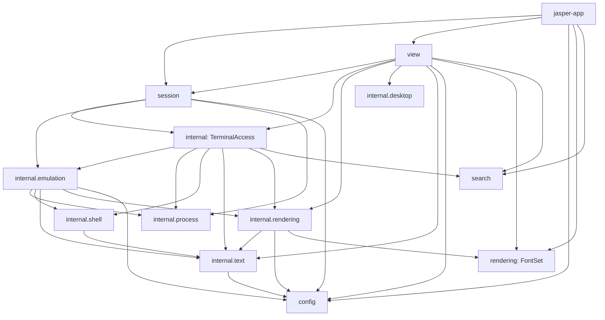
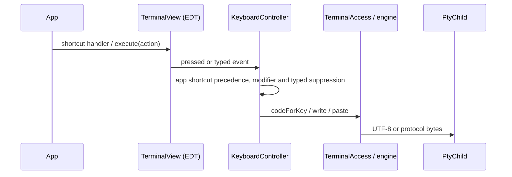
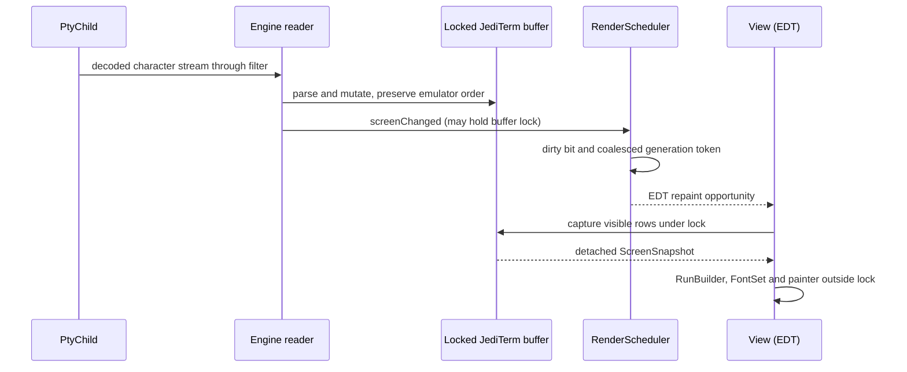
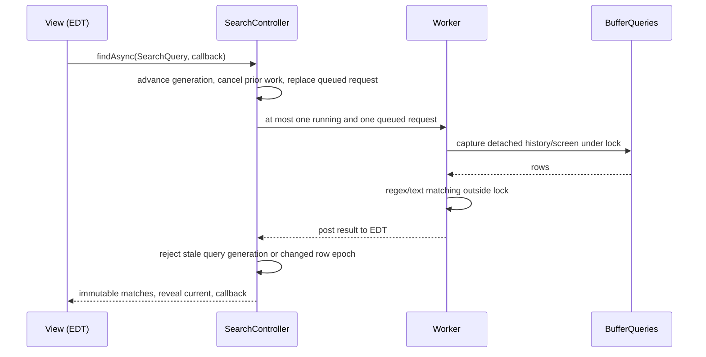
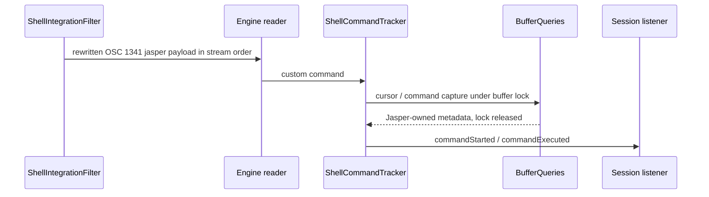

# Terminal architecture

Start at the [module README](../jasper-terminal/README.md) for installation and
compiled embedding examples. This guide describes the current implementation;
historical plans are decision records, not prerequisites for maintenance.

## Dependency direction

The terminal has one live model: JediTerm. Supported facades assemble concrete
owners, internal algorithms consume Jasper-owned values, and the app imports
only the supported allowlist. `./gradlew verifyTerminalArchitecture` derives the
package graph from bytecode and rejects cycles, terminal-to-app references,
JediTerm outside emulation, unsupported app types and app calls to `internalAccess`.
Generic public signatures are also checked by the terminal architecture test.

Arrows show package collaboration, including signatures and construction. No
internal package calls back through a session or view facade: callback values
carry notifications upward. JediTerm `PtyConnector` and `ShellIntegrationConnector`
are package-private in `internal.emulation`; native ownership lives in
`internal.process.PtyChild`. There is no emulator backend interface.

## Owners and patterns

| Owner | Responsibility and lifetime |
| --- | --- |
| `TerminalSession` | Facade for process lifetime, listeners, metadata and input; closed by the pane owner |
| `PtySessionFactory` | Factory wiring child → engine → queries/tracker → facade before starting the reader |
| `PtyChild`, `ForegroundJobResolver` | Native I/O, bounded shutdown and process metadata; one per session |
| `JediTermEngine` | Reader, emulator/display, protocol input, locked reset and vendor translation |
| `BufferQueries`, `JediCellReader` | Locked buffer reads and vendor-free row capture; no Swing state |
| `AbsoluteRowState` | Discard count, prompt rows and reset epoch, protected by buffer lock |
| `ShellCommandTracker` | Ordered shell marks, command text, cwd and monotonic duration |
| `TerminalAccess` | Unsupported concrete composition bridge; never the live buffer |
| `TerminalView`, `Viewport` | Swing assembly, one viewport, coordinated invalidation, attachment lifecycle |
| `KeyboardController`, `MouseController` | Key suppression/precedence and press-to-release gesture ownership |
| `SelectionController` | Selection anchors and overwrite-safe copy state |
| `SearchController` | Query generations, current match and bounded async search |
| `RenderScheduler`, `BellController` | Repaint/attachment generation, blink and coalesced bell lifecycle |
| `DesktopServices` | Clipboard and one shared lazy bounded browser worker |

The builders produce immutable validated options. `TerminalAction` is a closed
command enum reused by standalone shortcuts and the app's existing
[WindowContent catalog](../jasper-app/src/main/java/dev/jasper/app/workspace/WindowContent.java).
Parameterized paste/search/resize use typed methods. No command objects are
allocated for every keystroke. Vendor/native adapters and the filtered connector
decorator isolate integration. `TerminalSessionListener` is the observer contract.
These patterns give specific responsibilities homes; there is no general
controller superclass, service locator or plugin registry.

## Input and output

Mouse routing first decides between local gestures and terminal reports. A
reported gesture uses geometry only; it must not copy screen rows or trigger a
local repaint. Ownership and modifiers are captured at press and survive release.
Shift bypasses application mouse capture. Fractional wheel motion accumulates.

## Search and shell events

Clearing, invalidating or detaching cancels publication. Cancellation can be
cooperative; a stale worker must never publish merely because it finished.
An atomic row epoch is also captured at admission and checked before publication,
because a completed worker can already be queued ahead of the EDT reset notification.
The worker expires after one idle second. Visible highlights are bounded to the
viewport rather than rebuilt for every match in history.

OSC 7 and 133 are rewritten because the pinned emulator swallows them. OSC 8
links use the installed hyperlink filter. CSI `q` lacking a space intermediate
is dropped so XTVERSION/DECLL cannot override the configured cursor. DECSCUSR 0
is rewritten to restore configuration. Keep split-chunk parsing and payload
bounds. Do not infer a command's duration from session exit; commands run inside
one long-lived shell session.

## Threads and failures

| Work | Contract |
| --- | --- |
| Emulator loop and shell cycle | One reader per session; hooks fully wired before start |
| Live rows, cursor, history and prompt marks | Every read holds reentrant buffer lock; bounded work only |
| View, viewport, selections, highlights, fonts and timers | EDT; `execute` enforces this, other Swing methods rely on caller contract |
| Regex | Worker over captured rows; latest generation publishes on EDT |
| Screen/reset/alternate notifications | Synchronous on causing thread, possibly under buffer lock; never wait for EDT |
| Title/cwd/command callbacks | Reader protocol path; command callbacks after capture releases lock |
| Exit future | Completes at reader end; continuation thread unspecified |
| Foreground process lookup | Query off EDT; caller rejects stale results |
| Browser | Shared lazy worker, queue capacity 8; fixed logs, no raw target in logs |
| Child creation/waiting | Startup off EDT; close starts bounded asynchronous native cleanup |

| Failure or lifecycle event | Ownership and response |
| --- | --- |
| Invalid launch/options | Immutable value validation before process creation |
| Startup after child creation fails | Factory closes child and preserves original error, cleanup failure suppressed |
| Reader ends / child exits | Exit future completes; app decides whether to retain pane |
| Close called repeatedly | Child's atomic close guard makes cleanup idempotent |
| View removed | Listener removed, search cancelled, timers and queued attachment work invalidated; session stays open |
| View reattached | New attachment generation; stale frame/bell/search work cannot act as current work |
| Hidden view | Frame/blink work suppressed until useful again |
| Invalid regex | Empty matches plus user-facing error result |
| Search/browser work superseded or rejected | Search retains latest admission; browser drops rejected work without blocking EDT |
| History reset/reflow/buffer switch | Invalidate absolute-coordinate state together |

## Row coordinates and capture cost

Absolute row = `discardedLines + historyLines + screenRow`. Screen row 0 is the
live screen's top; negative buffer rows are history. Example: discarded 100,
history 20, screen row 2 gives absolute 122. One output scroll makes history 21
and moves that same line to screen row 1: still 122. With history capacity 21,
the next scroll discards one old line: discarded 101, history 21, screen row 0,
still 122. Thus scrolling output does not move a user's selected logical row.

ED 3 or RIS clears history and advances the epoch; old coordinates no longer
identify the same content. Width reflow and alternate-buffer changes also
invalidate anchors. The alternate screen exposes no history. Selection, search,
prompt navigation and scrolled-back viewport must agree on invalidation. ED 2
clears only the screen, not saved history. See
[AbsoluteRowState](../jasper-terminal/src/main/java/dev/jasper/terminal/internal/text/AbsoluteRowState.java)
and [EvictionTest](../jasper-terminal/src/test/java/dev/jasper/terminal/internal/emulation/EvictionTest.java).

`TerminalRow` has two real implementations inside
[JediCellReader](../jasper-terminal/src/main/java/dev/jasper/terminal/internal/emulation/JediCellReader.java):
a locked live row for bounded queries, and a compact detached row for snapshots.
The detached row captures entry membership, wrap state and text length once,
retaining opaque vendor entries that pinned JediTerm replaces on overwrite.
The known NUL-to-space append mutation is handled using captured length and
blank-cell semantics. Tests cover overwrite and append. No vendor values cross
the row interface. Translate styles on read with reusable run scratch storage;
do not allocate a new object for each screen cell or add another full-screen copy.

This depends on pinned JediTerm 3.76 entry mutation behavior: revalidate on any
upgrade. Full-width cell arrays were measured and rejected for much higher
capture allocation/time. The accepted representation and headless measurements
are recorded in [verification](terminal-refactor-verification.md); headless
painting cannot establish native GPU throughput, RSS or desktop fidelity.

## Options and future extension

Font, ligatures, line height, palette, cursor defaults, Option-as-Meta,
copy-on-select and bell mode are live view options. `applyOptions` updates their
owners and preserves the session. Shell, environment, working directory and
scrollback capacity are new-session choices; changing the view's options does
not resize its existing history. Grid dimensions can change through view layout
or explicit session resize. Program cursor requests still override configured
defaults until reset. App configuration reload and temporary overrides remain
app policy, tested separately.

Future SDK work can adapt typed actions, immutable settings and listener events,
with capability/lifetime/thread contracts decided at that time. Do not export
controllers, `TerminalAccess`, mutable buffer state, vendor types or worker
executors. Core plugins should eventually use the same supported SDK capabilities
as external plugins. No plugin loader, SDK interface or emulator swap layer is
implemented in this refactor.
