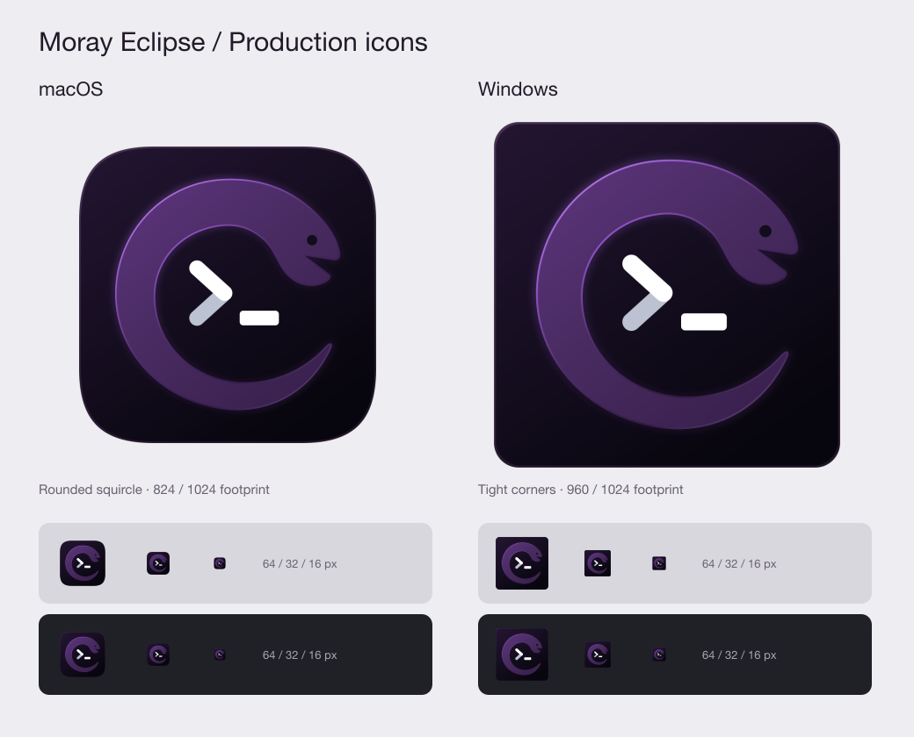

# Moray app icon

The official icon is **Eclipse**, with the user-approved brighter purple eel,
directional violet rim/glow, and white two-tone terminal prompt.



## Source and outputs

- `moray.svg` is the editable, approved master. Edit its named SVG layers in Inkscape.
- `moray-macos.svg` and `moray-windows.svg` are generated platform layouts.
- `Moray.icns` and `Moray.ico` are committed native package inputs.
- `moray-app/src/main/resources/dev/moray/app/icons/app/` contains the corresponding
  PNG representations loaded by Swing and the development-launch Dock icon.

The platform transformation changes only framing. Eel geometry, body colors
(`#5C347C`, `#492B61`, `#371F4B`), outline gradient, glow, eye, and prompt are preserved.

## Platform framing

**macOS:** A rounded squircle occupies an 824×824 area centered in the 1024×1024
canvas, giving a single 100px transparent margin on each side. This is the legacy
ICNS pipeline used by jpackage, not an Icon Composer asset: the shape and margin
are already baked into every representation. Do not add another margin in the
runtime image or resize it again when packaging. A local reference measurement
of Apple's Terminal ICNS showed an opaque 204px footprint on a 256px canvas;
Moray measures 206px. This checks optical scale without claiming live Dock or
Cmd+Tab acceptance. The native image and runtime PNG use the same artwork.

The ICNS contains 16, 32, 128, 256 and 512 point representations at 1× and 2×,
including the 1024px representation. These use Apple's documented
[ICNS/iconset convention](https://developer.apple.com/library/archive/documentation/GraphicsAnimation/Conceptual/HighResolutionOSX/Optimizing/Optimizing.html).

**Windows:** The tighter corner shape occupies 960×960 of the 1024px canvas,
leaving a 32px margin. Its multi-image, 32-bit-alpha ICO includes 16, 20, 24, 30,
32, 36, 40, 48, 60, 64, 72, 80, 96, 128 and 256px PNG frames. This covers the
common desktop/DPI sizes in Microsoft's
[Windows icon construction guidance](https://learn.microsoft.com/en-us/windows/apps/design/iconography/app-icon-construction).
Moray is a jpackage desktop application, not an MSIX/UWP app; tile manifests and
UWP padding variants do not apply. Windows native builds embed the ICO in
`Moray.exe`; each JFrame also supplies the corresponding images for its titlebar,
taskbar and app switcher.

## Regeneration

On macOS with Python 3 and Inkscape installed:

```bash
python3 packaging/icons/generate.py
# Or specify an alternate Inkscape executable:
python3 packaging/icons/generate.py --inkscape /path/to/inkscape
```

The generator uses only Python's standard library, Inkscape and Apple's
`iconutil`. It renders each size directly from SVG. Ordinary builds consume the
committed assets and require none of these authoring tools on either platform.

```bash
./gradlew :moray-app:test --tests dev.moray.app.ApplicationIconTest
./gradlew check :moray-app:packageDist
```

Packaging tracks the native icon as an input. Verification checks the macOS
bundle's `CFBundleIconFile` and exact ICNS bytes, or that every ICO frame is
embedded in the Windows executable, without launching Moray.

## Verification — 2026-09-12

- Asset tests first failed on missing production files, then passed with the assets.
- `./gradlew check :moray-app:packageDist` passed: 580 tests represented in the
  result XML, 579 passed and one existing terminal font skip. Unchanged terminal
  checks were up to date; app tests executed with the four new icon tests.
- All 15 ICO payloads decode with alpha and match runtime PNGs; ICNS round-trips
  through iconutil into all 10 standard/Retina representations.
- Exact eel, prompt and lighting SVG layers match the approved master.
- The macOS app/DMG built; bundle icon identity, bytes, native architecture,
  runtime, strict ad-hoc signature and DMG integrity verification passed.
- Independent code review found no issues.
- Rendered platform layouts were inspected at large and small sizes on light and
  dark backgrounds. Live Dock/Cmd+Tab and Windows desktop/packaging acceptance
  remain unrun on this macOS host. No GUI or login shell was launched.

The 444 exploratory design files were removed from the project and moved to the
user's Trash with hashes verified. The official master is preserved here.
